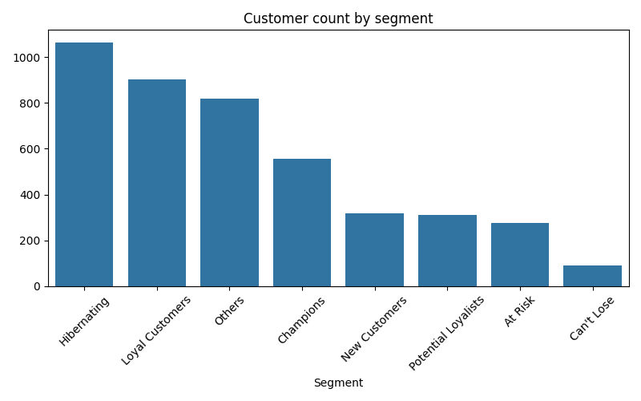
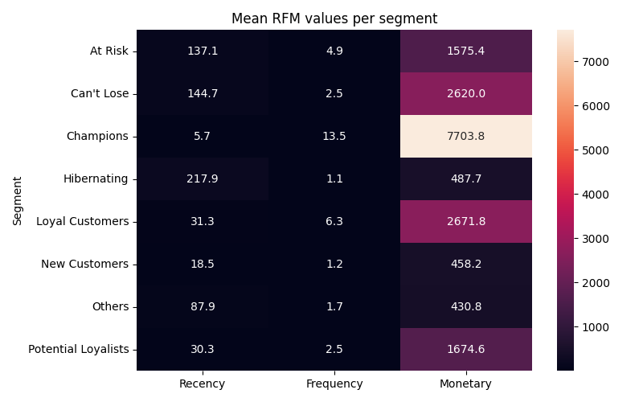

# RFM Customer Segmentation

*Dataset:* [UCI Online Retail Dataset](https://archive.ics.uci.edu/ml/datasets/Online+Retail)  
*Author:* Kaleem Ullah Sabir  

## 📋 Overview
This project performs *RFM (Recency, Frequency, Monetary) Analysis* on the Online Retail dataset to segment customers based on their purchase behavior.

### Task Description
- Analyze customer behavior based on:
  - **Recency**: How recently a customer made a purchase
  - **Frequency**: How often they made purchases
  - **Monetary**: How much money they spent
- Assign R, F, M scores to each customer
- Group customers based on these scores
- Suggest marketing strategies for each group (e.g., discounts for loyal buyers, re-engagement for inactive customers)

## 🛠 Tools & Libraries
- Python  
- Pandas  
- Seaborn  

## 📌 Covered Topics
- Feature engineering  
- Segmentation logic  
- Customer analytics  
- Data visualization (bar charts, heatmaps)

## 📂 Files in this Repository
- `rfm_segmentation_notebook.ipynb` — Jupyter notebook with full RFM analysis  
- `rfm_segmentation_notebook.html` — HTML version of the notebook  
- `rfm_segments.csv` — Final RFM scores and segments  
- `segment_count_barplot.png` — Bar chart of customer count by segment  
- `rfm_heatmap.png` — Heatmap of mean RFM values per segment  
- `README.md` — Project description

## 📊 Visualizations
1. **Customer count by segment**  
   

2. **Mean RFM values per segment (Heatmap)**  
   

## ▶ Usage
1. Open `rfm_segmentation_notebook.ipynb` in Jupyter or Google Colab.  
2. Run all cells to reproduce analysis and visualizations.  
3. Figures are saved automatically in the repo as PNG files.  
4. `rfm_segments.csv` contains the final RFM scores and customer segments.

